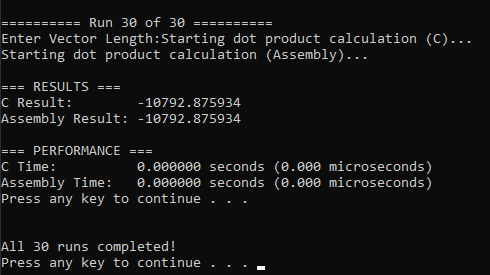

# Dot Product Kernel using C and x86-64 Assembly

## Project Overview
This project implements and benchmarks a **dot product kernel** using two approaches:  
1. **C program kernel** (reference version and sanity check).  
2. **x86-64 Assembly kernel** using scalar SIMD floating-point instructions.  

The kernel computes:  

$$
sdot = \sum_{i=1}^{n} A[i] \times B[i]
$$

where:
- `n` is the vector length.
- `A` and `B` are vectors of double-precision floats.
- `sdot` is a scalar double-precision result.  

## Implementation Details

### C Kernel
The C kernel uses a simple loop and standard floating-point multiplication and addition. It acts as the reference implementation.

### x86-64 Assembly Kernel
- Written in MASM syntax.
- Uses **`movsd`**, **`mulsd`**, and **`addsd`** scalar floating-point instructions.

## Performance Comparison  

| Vector Size      | C Kernel (Average) | ASM Kernel (Average) |
|-----------------|-------------------|----------------------|
| 2^20 (≈ 1M)     | 00.00 s           | 00.00 s             |
| 2^24 (≈ 16M)    | 00.00 s           | 00.00 s             |
| 2^28 (≈ 268M)   | 1.323900 s           | 0.458200 s              |

**Observation:** 
- The assembly kernel runs faster than the C kernel for very large vectors (2^29).
- There is no difference for smaller and medium vector sizes (2^20 and 2^24).
- For very large vectors (2^29), the performance gap narrows because memory access speed becomes the main bottleneck.
- Both kernels produce correct and consistent results.

## Analysis

The performance improvement of the assembly kernel could be due to the use of scalar SIMD instructions (`mulsd` and `addsd`) and reduced overhead in loop control compared to the C implementation.

For smaller and medium vector sizes, this would allow the assembly kernel to execute more efficiently and achieve lower execution times. At the largest vector size (2^29), the advantage would decrease because the program becomes memory-bound, where memory bandwidth limits performance for both implementations.

The assembly version showed how low-level optimizations can reduce execution time in compute-heavy operations.

## How to Build and Run

### Build Steps
#### Windows
```bash
nasm -f win64 kernel.asm
gcc -c main.c -o main.c.obj -m64
gcc -c dot_product_c.c -o dot_product_c.obj -m64
gcc main.c.obj dot_product_c.obj kernel.obj -o main.exe -m64
main.exe
```
## Screenshots


